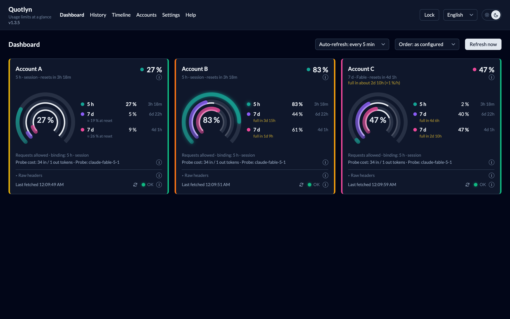
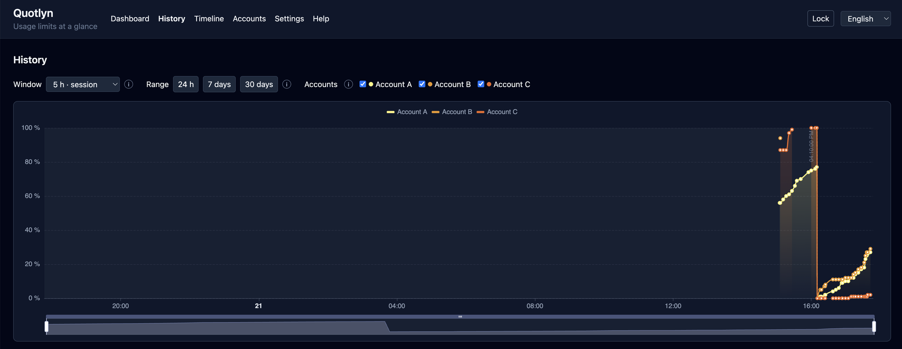
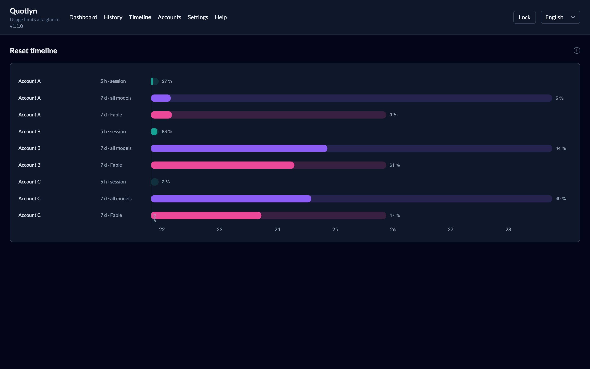
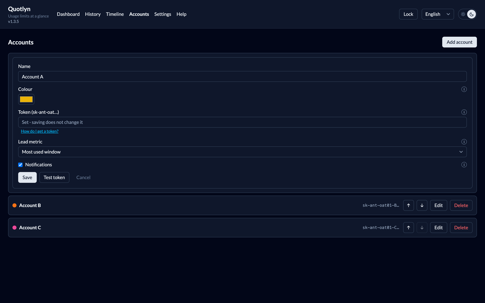
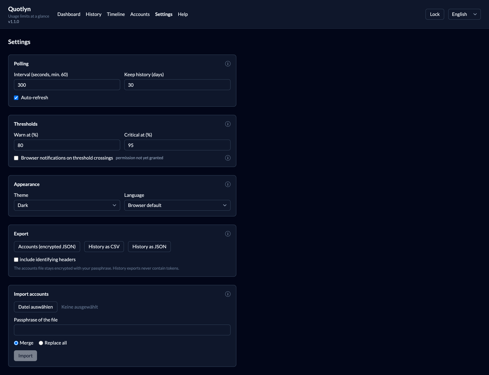
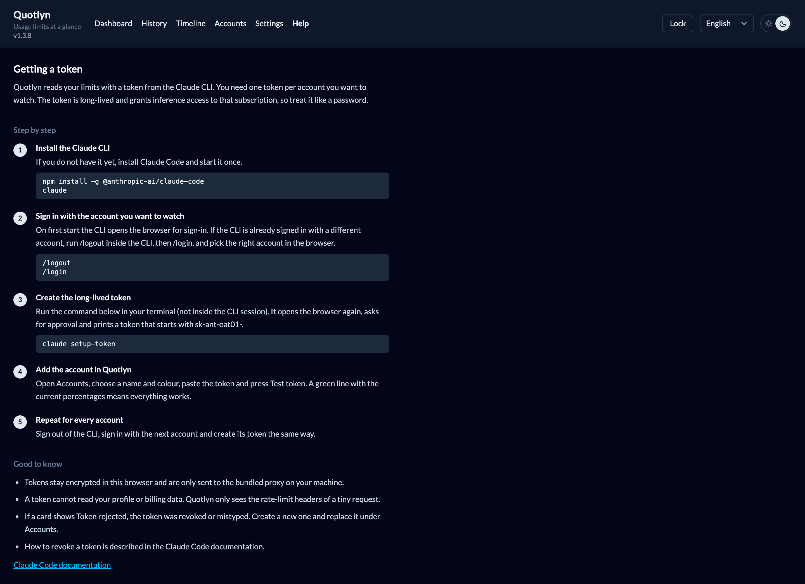

<p align="center">
  
</p>

<h1 align="center">Quotlyn</h1>

<p align="center">
  Keep an eye on the usage limits of several Claude subscription accounts, side by side, on your own machine.
</p>

<p align="center">
  <a href="#quick-start">Quick start</a> ·
  <a href="#what-you-get">What you get</a> ·
  <a href="#how-it-reads-the-numbers">How it works</a> ·
  <a href="#security">Security</a> ·
  <a href="#configuration">Configuration</a>
</p>



Quotlyn is a small self-hosted dashboard. It runs in one Docker container,
polls every configured account on an interval, keeps a history in your
browser and renders the current state as rings, trend charts and a reset
timeline. Nothing leaves your machine except the tiny probe request that
reads the limits.

## Quick start

You need Docker with Compose (or Node 22+) and one token per account,
created with the Claude CLI:

```sh
claude setup-token
```

Then:

```sh
git clone https://github.com/SteffenSchmitt/quotlyn.git
cd quotlyn
docker compose up --build
```

Open <http://localhost:5173>, choose a passphrase, add your accounts under
*Accounts* and press *Test token*. The built-in *Help* page walks through
creating a token for each account.

Without Docker: `npm install && npm run dev`.

## What you get

**Dashboard.** One card per account. Three nested rings show the 5-hour
session window, the 7-day window for all models and the 7-day Fable window,
each with a countdown to its reset. The big number is the account's lead
metric, which you pick per account. Rings glow as a window approaches your
warn and critical thresholds. Cards can be ordered as configured or by
remaining room.


**History.** Utilization over time per account and window, for the last 24
hours, 7 or 30 days. Shaded bands mark the periods between resets.



**Reset timeline.** One bar per account and window, from now until that
window resets, filled by current utilization. Handy for deciding which
account to use next.



**Accounts.** Name, colour, token, lead metric and per-account
notifications. Reorder with the arrows, test a token before saving.



**Settings.** Polling interval and history retention, warn and critical
thresholds, browser notifications, theme and language, plus export and
import.



**Help.** A step-by-step guide to obtaining a token, right inside the app.



Also included:

- Every response header the API returns, unchanged, behind *Raw headers* on
  each card. Identifying values are masked by default; headers Quotlyn does
  not know yet are flagged as new, so nothing the API adds goes unnoticed.
- Browser notifications when a window crosses a threshold, once per
  crossing rather than on every poll.
- Export of the encrypted account file and of the history as CSV or JSON.
  Import merges or replaces accounts from an exported file.
- German and English interface, light and dark theme, small info tips next
  to every control.

## How it reads the numbers

Tokens from `claude setup-token` only carry the inference scope, so the
dedicated usage endpoint rejects them. Quotlyn instead sends the cheapest
possible Messages request, one output token, and reads the
`anthropic-ratelimit-unified-*` headers of the response. Those are the same
numbers the Claude CLI shows under `/usage`.

The probe goes to Fable by default, because the model-specific weekly
window only appears on requests for that model. The API serves the larger
models to these tokens only when the request carries the Claude CLI's
system prompt, so the probe sends that one line. If the Fable probe is rate
limited, Quotlyn retries with Haiku and flags the missing window on the
card. A poll costs roughly 35 tokens of quota; the default interval is five
minutes and accounts are probed one after another.

When a window is used up, the API answers with 429 but still includes the
headers. Quotlyn shows that as *Limit reached* with current numbers rather
than treating it as an error.

The bundled proxy (`proxy/server.mjs`, no dependencies) exists only because
a browser cannot call the API directly. It forwards your token, sends the
probe and returns the headers as JSON. It stores nothing and never logs
headers or bodies.

## Security

- Tokens are stored in your browser, encrypted with a passphrase
  (PBKDF2, 600 000 iterations, AES-GCM). The passphrase is never stored.
  *Keep unlocked for this session* keeps the derived key in `sessionStorage`
  until the tab is closed.
- A token grants inference access to that subscription. Run Quotlyn only on
  a machine you control; anyone who can reach the port and knows your
  passphrase can read your tokens.
- History exports never contain tokens. Organisation and workspace ids are
  included only if you tick the box.

## Configuration

| Variable | Default | Purpose |
|---|---|---|
| `QUOTLYN_WEB_PORT` | `5173` | Host port for the web UI (Compose) |
| `QUOTLYN_PROXY_HOST_PORT` | `8787` | Host port for the proxy (Compose) |
| `QUOTLYN_PROBE_MODEL` | `claude-fable-5-1` | Model for the primary probe |
| `QUOTLYN_FALLBACK_MODEL` | `claude-haiku-4-5-20251001` | Model for the retry when the primary is rate limited |
| `QUOTLYN_UPSTREAM` | `https://api.anthropic.com` | Upstream base URL, useful for a mock during development |

Example: `QUOTLYN_WEB_PORT=5174 docker compose up` runs the container on a
different port so a host-side `npm run dev` can coexist with it.

## Development

```sh
npm test          # Vitest
npm run typecheck # vue-tsc
```

The header shows the version from `package.json`; bump it with every change
to the app.

Vue 3, TypeScript, Pinia, Tailwind, vue-i18n and Apache ECharts. Pure
logic (parsing, polling, thresholds, crypto, export) lives in framework-free
modules with unit tests; components stay thin.

## License

MIT, see [LICENSE](LICENSE).
