<p align="center">
  
</p>

<h1 align="center">Quotlyn</h1>

<p align="center">
  Usage limits of your Claude Pro and Max subscriptions, side by side, on your own machine.
</p>

<p align="center">
  <a href="CHANGELOG.md"></a>
  <a href="LICENSE"></a>
  
  
  
  
</p>

<p align="center">
  <a href="#why-quotlyn">Why</a> ·
  <a href="#quick-start">Quick start</a> ·
  <a href="#the-three-windows">The three windows</a> ·
  <a href="#what-you-see">What you see</a> ·
  <a href="#how-it-reads-the-numbers">How it works</a> ·
  <a href="#security">Security</a> ·
  <a href="#configuration">Configuration</a> ·
  <a href="#contributing">Contributing</a>
</p>

<picture>
  <source media="(prefers-color-scheme: dark)" srcset="docs/screenshots/dashboard.png">
  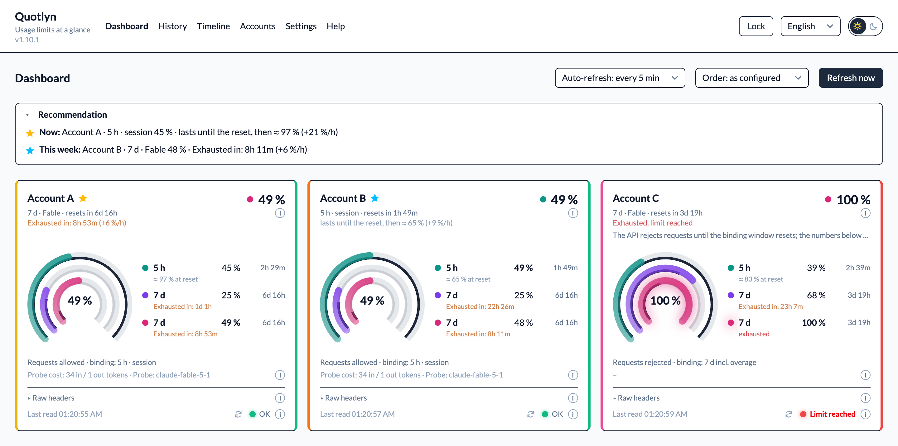
</picture>

## Why Quotlyn

Claude Code shows you `/usage` for the account you are signed in with. If
you work with more than one Claude subscription, say a personal Max plan
and one from your team, you keep switching accounts just to see which one
still has room in its 5-hour session or its weekly window.

Quotlyn polls every account you give it a token for, shows all three limit
windows per account as nested rings, keeps a history of every reading and
forecasts when a window will run out. It warns you before you hit a limit
and tells you, on a timeline, which account to use next.

It runs in a single Docker container on your machine. Tokens stay in your
browser, encrypted with a passphrase. The only thing that ever leaves your
machine is the tiny probe request that reads the limits, sent to the same
API Claude Code talks to.

## Quick start

You need Docker with Compose (or Node 22+) and one token per account. The
token comes from the Claude CLI and works for Pro and Max subscriptions;
an API key from the Console is not what you want here.

```sh
claude setup-token
```

Then:

```sh
git clone https://github.com/SteffenSchmitt/quotlyn.git
cd quotlyn
docker compose up --build
```

Open <http://localhost:5173>, choose a passphrase, add your accounts under
*Accounts* and press *Test token*. The built-in *Help* page walks through
creating a token for each account.

Without Docker: `npm install && npm run dev`.

## The three windows

Every Claude subscription is limited by three rolling windows. Quotlyn
reads all of them from the API and shows each as its own ring, line and bar.

| Window | Key | What it limits | Resets |
|---|---|---|---|
| **Session** | `5h` | Everything you send within a 5-hour session, across all models | 5 hours after the first message of the session |
| **Week, all models** | `7d` | Your total usage over seven days, across all models | 7 days after the first message of the cycle |
| **Week, Fable** | `7d_oi` | Your usage of the largest model over seven days | On its own 7-day cycle, independent of the other two |

Each window has a utilization from 0 to 100 % and a reset time. When a
window is used up the API rejects requests until it resets; Quotlyn shows
that as *Limit reached* with the current numbers rather than as an error.

## Features at a glance

<table>
  <tr>
    <td width="50%"><picture>
  <source media="(prefers-color-scheme: dark)" srcset="docs/screenshots/feature-card.png">
  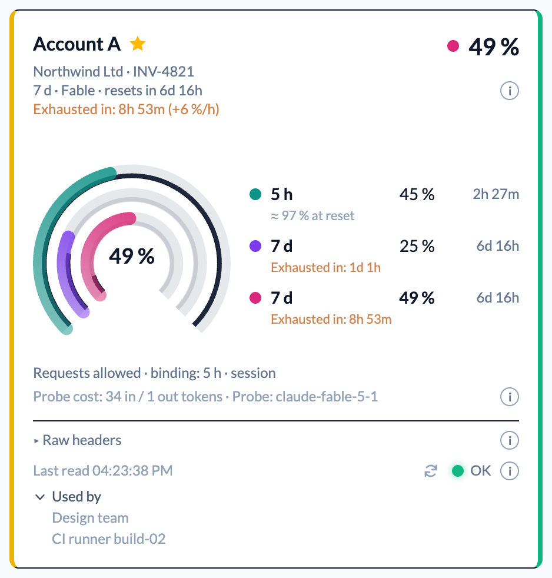
</picture></td>
    <td width="50%"><picture>
  <source media="(prefers-color-scheme: dark)" srcset="docs/screenshots/feature-rings.png">
  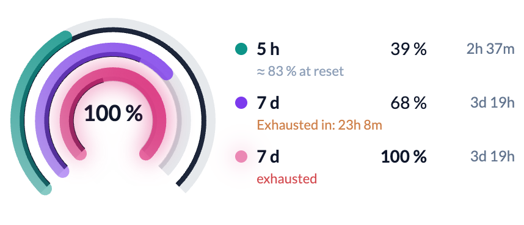
</picture></td>
  </tr>
  <tr>
    <td valign="top"><b>One card per account.</b> Lead metric, reset countdown, forecast line, and a traffic light on the right edge by the most used window. Poll a single account with the arrow in the footer.</td>
    <td valign="top"><b>Three rings, one clock each.</b> Session, week and week-Fable as nested rings; the thin clock inside each ring runs from the last reset to the next and ends where the window is expected to run out.</td>
  </tr>
  <tr>
    <td><picture>
  <source media="(prefers-color-scheme: dark)" srcset="docs/screenshots/feature-recommendation.png">
  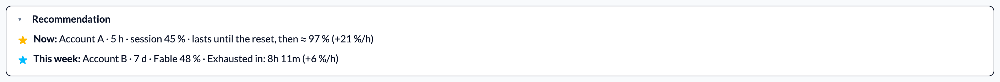
</picture></td>
    <td><picture>
  <source media="(prefers-color-scheme: dark)" srcset="docs/screenshots/feature-status.png">
  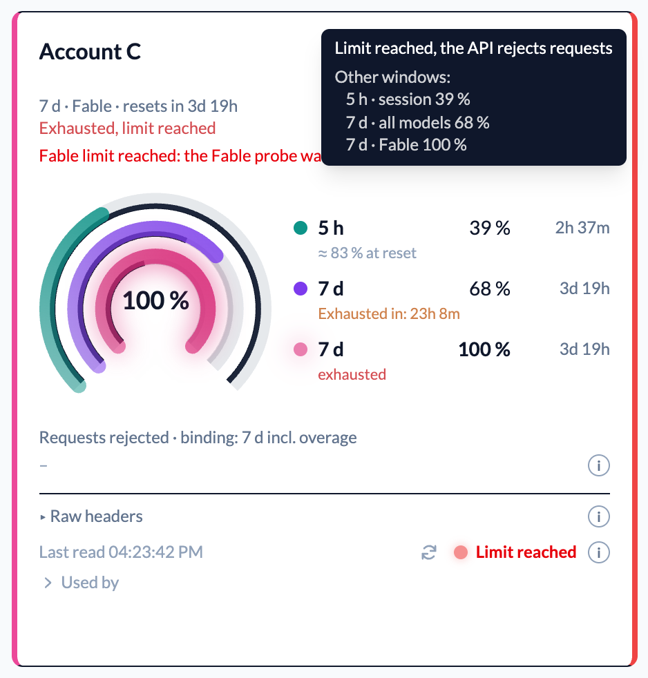
</picture></td>
  </tr>
  <tr>
    <td valign="top"><b>Which account now.</b> The account with the most session headroom and the one with the widest weekly window, each with its forecast, as stars on the cards and a collapsible strip.</td>
    <td valign="top"><b>Why the colour.</b> Hover the card edge for the window that decides, the threshold it crossed and every other window.</td>
  </tr>
  <tr>
    <td><picture>
  <source media="(prefers-color-scheme: dark)" srcset="docs/screenshots/feature-history.png">
  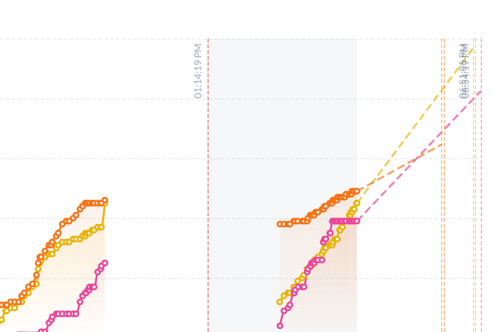
</picture></td>
    <td><picture>
  <source media="(prefers-color-scheme: dark)" srcset="docs/screenshots/feature-timeline.png">
  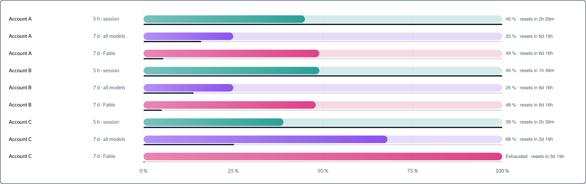
</picture></td>
  </tr>
  <tr>
    <td valign="top"><b>History with projection.</b> Every reading as a line, reset bands, and a dashed continuation to the expected exhaustion or the reset. Gaps stay gaps.</td>
    <td valign="top"><b>Reset timeline.</b> Capacity, utilization and time to the reset per window, the same clock beneath each bar, sortable by soonest exhaustion or by window.</td>
  </tr>
  <tr>
    <td><picture>
  <source media="(prefers-color-scheme: dark)" srcset="docs/screenshots/feature-settings-forecast.png">
  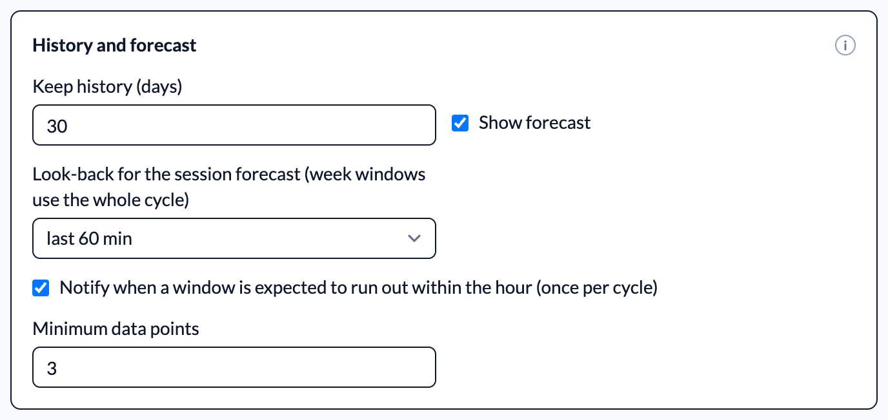
</picture></td>
    <td><picture>
  <source media="(prefers-color-scheme: dark)" srcset="docs/screenshots/feature-settings-alerts.png">
  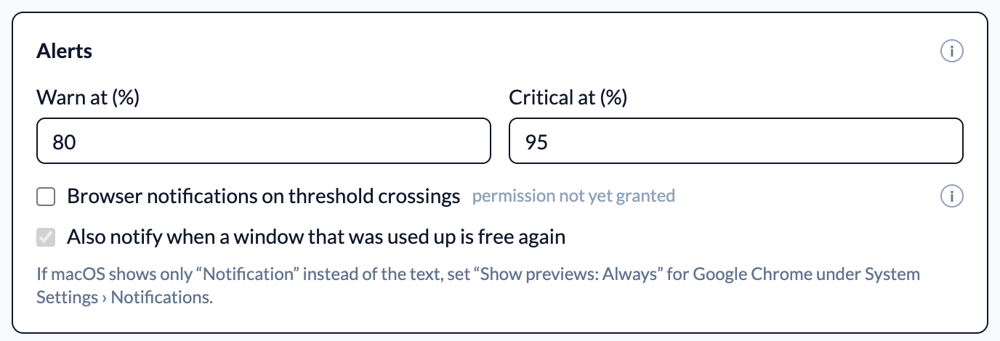
</picture></td>
  </tr>
  <tr>
    <td valign="top"><b>Forecast, your way.</b> Look-back for the session forecast, minimum data points, and a notification when a window is expected to run out within the hour.</td>
    <td valign="top"><b>Alerts.</b> Warn and critical thresholds drive rings, traffic light and browser notifications, once per crossing, plus a note when a used-up window is free again.</td>
  </tr>
  <tr>
    <td><picture>
  <source media="(prefers-color-scheme: dark)" srcset="docs/screenshots/feature-meta.png">
  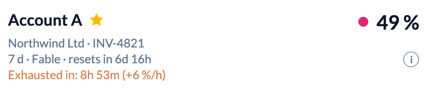
</picture></td>
    <td><picture>
  <source media="(prefers-color-scheme: dark)" srcset="docs/screenshots/feature-columns.png">
  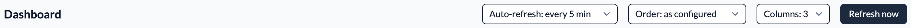
</picture></td>
  </tr>
  <tr>
    <td valign="top"><b>Whose account is this.</b> A billing account under the name and a note on who uses it, folded into the card's footer. Show the billing account in full, masked down to its first and last characters, or keep it off the cards while timeline and history still show it.</td>
    <td valign="top"><b>Two, three or four to a row.</b> Pick how many cards share a row. The count is an upper bound, so narrower windows still step down and the cards stay readable.</td>
  </tr>
</table>

## What you see

### Dashboard

One card per account. Three nested rings show the session window, the
weekly window and the weekly Fable window, each with a countdown to its
reset. The big number is the account's lead metric, which you pick per
account. Rings glow as a window approaches your warn and critical
thresholds, and the right edge of each card is a traffic light: green,
amber or red by the most used window, always red while the limit is
reached. Hover it to see why. Each card can be polled on its own, and cards
can be ordered as configured or by remaining room, two, three or four to a
row. The row count is an upper bound: narrower windows still step down, so
cards stay readable on a laptop or half a screen.

Above the cards Quotlyn names the account to use next: an amber star for
the session with the most headroom, a sky-blue one for the account whose
tighter weekly window has the most room, each with its forecast.

Meta information from the account settings appears here where it is set:
the billing account in grey under the name, and a note on who uses the
account, folded away in the card's footer. The billing account can be
shown in full, masked down to its first and last characters, or kept off
the cards while timeline and history still show it in their tooltips.

### Forecast

From the readings of the current cycle Quotlyn fits the slope of each
window and tells you when it will be full, or how full it will be at the
reset. The session window uses a configurable look-back, the weekly windows
the whole cycle from 0 %, because a busy hour says nothing about a week.
Once a previous week is in the history, the weekly forecast also blends in
what happened over the same remaining span last week.

On the cards the forecast is a line under the lead metric and a thin white
clock inside each ring: the clock runs from the last reset to the next and
ends where the window is expected to run out. A full clock means the
window lasts. The forecast can be switched off.

### History and timeline

<table>
  <tr>
    <td width="50%"><picture>
  <source media="(prefers-color-scheme: dark)" srcset="docs/screenshots/history.png">
  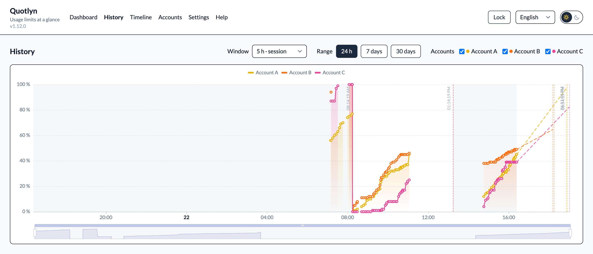
</picture></td>
    <td width="50%"><picture>
  <source media="(prefers-color-scheme: dark)" srcset="docs/screenshots/timeline.png">
  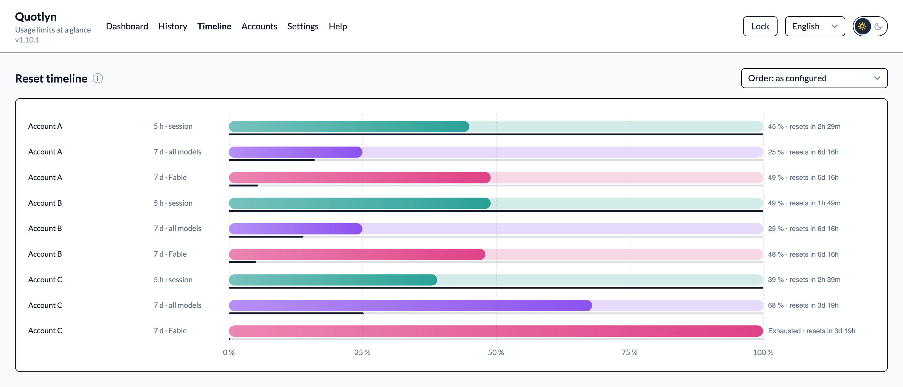
</picture></td>
  </tr>
  <tr>
    <td valign="top"><b>History.</b> Utilization over time per account and window, for the last 24 hours, 7 or 30 days. Shaded bands mark the periods between resets; each line continues as a dashed projection to the expected exhaustion or the reset.</td>
    <td valign="top"><b>Reset timeline.</b> One bar per account and window: the bar is the full capacity, the fill the current utilization, the time to the reset at its end. The line beneath is the same clock as in the rings, from now to the reset. Order the rows as configured, by soonest exhaustion or by window.</td>
  </tr>
</table>

### Accounts and settings

<table>
  <tr>
    <td width="50%"><picture>
  <source media="(prefers-color-scheme: dark)" srcset="docs/screenshots/accounts.png">
  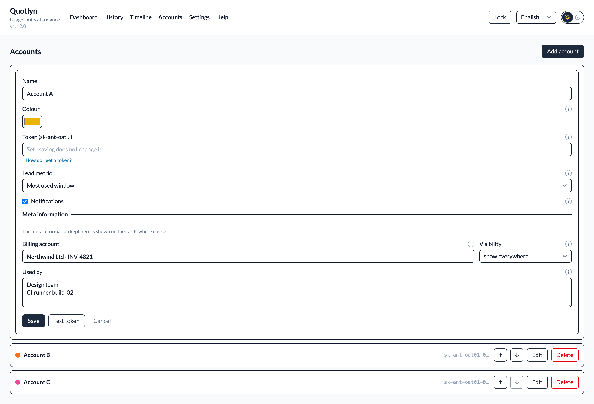
</picture></td>
    <td width="50%"><picture>
  <source media="(prefers-color-scheme: dark)" srcset="docs/screenshots/settings.png">
  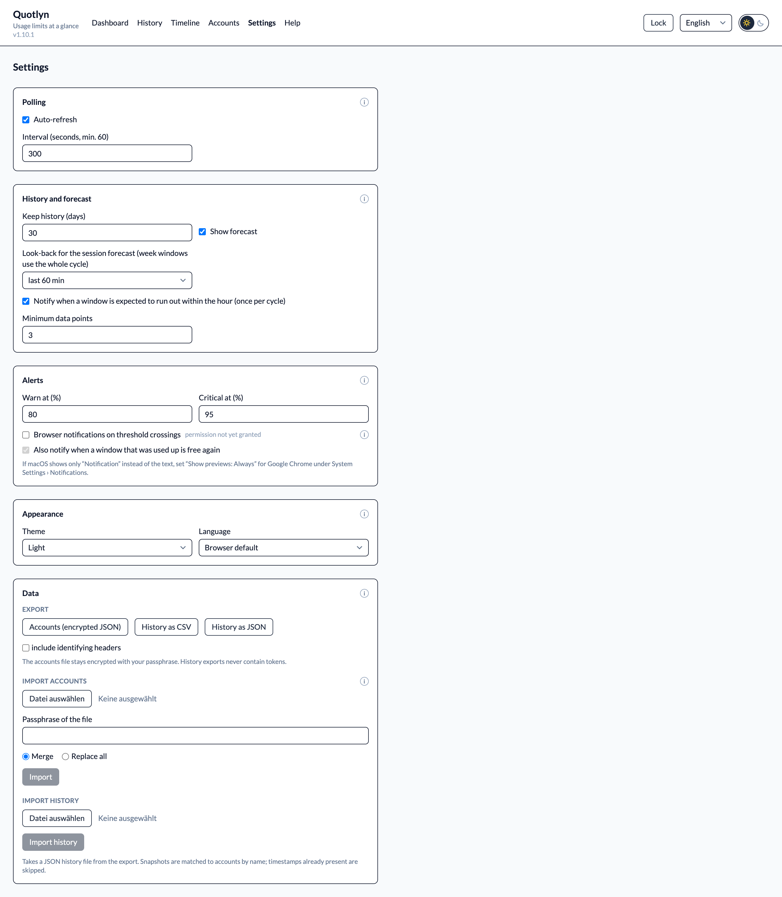
</picture></td>
  </tr>
  <tr>
    <td valign="top"><b>Accounts.</b> Name, colour, token, lead metric and per-account notifications. Reorder with the arrows, test a token before saving. A meta section holds the billing account and a note on who uses the account.</td>
    <td valign="top"><b>Settings.</b> Polling, history retention and forecast, warn and critical thresholds with browser notifications, theme and language, and export and import of your data.</td>
  </tr>
</table>

### Help

A step-by-step guide to obtaining a token, right inside the app.

<picture>
  <source media="(prefers-color-scheme: dark)" srcset="docs/screenshots/help.png">
  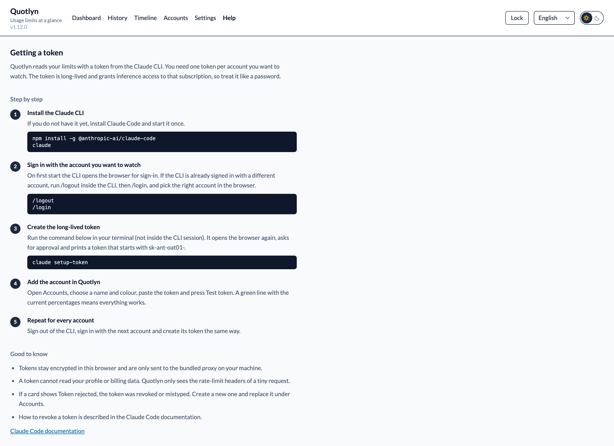
</picture>

### Also included

- Every response header the API returns, unchanged, behind *Raw headers* on
  each card. Identifying values are masked by default; headers Quotlyn does
  not know yet are flagged as new, so nothing the API adds goes unnoticed.
- Browser notifications when a window crosses a threshold, once per
  crossing rather than on every poll, when a window is expected to run out
  within the hour, once per cycle, and when a used-up window is free
  again. They say which window, how far it is and when it resets.
- The browser tab shows the highest utilization in its title and in the
  favicon, so a glance at the tab bar is enough. Quotlyn can be installed
  as a standalone app from the browser.
- Export of the encrypted account file and of the history as CSV or JSON.
  Import merges or replaces accounts from an exported file, and a history
  export can be imported again on another browser or machine.
- German and English interface, a sun/moon switch in the header for light
  and dark theme.

## How it reads the numbers

Tokens from `claude setup-token` only carry the inference scope, so the
dedicated usage endpoint rejects them. Quotlyn instead sends the cheapest
possible Messages request, one output token, and reads the
`anthropic-ratelimit-unified-*` headers of the response. Those are the same
numbers Claude Code shows under `/usage`.

The probe goes to Fable by default, because the model-specific weekly
window only appears on requests for that model. The API serves the larger
models to these tokens only when the request carries the Claude CLI's
system prompt, so the probe sends that one line. If the Fable probe is rate
limited, Quotlyn retries with Haiku and flags that on the card. A poll costs
roughly 35 tokens of quota; the default interval is five minutes and
accounts are probed one after another.

When a window is used up, the API answers with 429 but still includes the
headers. Quotlyn shows that as *Limit reached* with current numbers rather
than treating it as an error.

A request turned away before it runs is answered with a limit snapshot
frozen at that moment. So once the weekly Fable window is used up, Quotlyn
repeats the probe with Haiku, which that window does not block: session and
week then keep moving, and the exhausted Fable window is carried over from
the rejected answer. If a window every model shares is the one that is out,
no second probe is sent — nothing would run anyway.

The bundled proxy (`proxy/server.mjs`, no dependencies) exists only because
a browser cannot call the API directly. It forwards your token, sends the
probe and returns the headers as JSON. It stores nothing and never logs
headers or bodies.

## Security

- Tokens are stored in your browser, encrypted with a passphrase
  (PBKDF2, 600 000 iterations, AES-GCM). The passphrase is never stored.
  *Keep unlocked for this session* keeps the derived key in `sessionStorage`
  until the tab is closed.
- A token grants inference access to that subscription. Run Quotlyn only on
  a machine you control; anyone who can reach the port and knows your
  passphrase can read your tokens.
- History exports never contain tokens. Organisation and workspace ids are
  included only if you tick the box.

## Configuration

| Variable | Default | Purpose |
|---|---|---|
| `QUOTLYN_WEB_PORT` | `5173` | Host port for the web UI (Compose) |
| `QUOTLYN_PROXY_HOST_PORT` | `8787` | Host port for the proxy (Compose) |
| `QUOTLYN_PROBE_MODEL` | `claude-fable-5-1` | Model for the primary probe |
| `QUOTLYN_FALLBACK_MODEL` | `claude-haiku-4-5-20251001` | Model for the retry when the primary is rate limited |
| `QUOTLYN_UPSTREAM` | `https://api.anthropic.com` | Upstream base URL, useful for a mock during development |

Example: `QUOTLYN_WEB_PORT=5174 docker compose up` runs the container on a
different port so a host-side `npm run dev` can coexist with it.

## Development

```sh
npm run dev:mock  # the app against a fake API on http://localhost:15173, no token needed
npm test          # Vitest
npm run build     # vue-tsc + Vite, the type gate for .vue files
npm run smoke     # every page in a headless browser against the mock, fails on page errors
```

Vue 3, TypeScript, Pinia, Tailwind, vue-i18n and Apache ECharts. Pure
logic (parsing, polling, thresholds, forecast, crypto, export) lives in
framework-free modules with unit tests; components stay thin. Tests,
build and the smoke test run in CI on every push. The mock API and the screenshot tooling are
described in [scripts/screenshots/README.md](scripts/screenshots/README.md).

The header shows the version from `package.json`. Releases go through
`npm run release -- <version|major|minor|patch>`: it runs the checks, bumps
the version and the badge, regenerates [CHANGELOG.md](CHANGELOG.md) from
the git tags, commits, tags and pushes.

## Contributing

Issues and pull requests are welcome. [CONTRIBUTING.md](CONTRIBUTING.md)
has the setup, the checks to run and the conventions; the short version:
run `npm test` and `npm run build`, add a test for logic you touch, add
both languages for new strings, and never paste a token into an issue.

## License

MIT, see [LICENSE](LICENSE).
